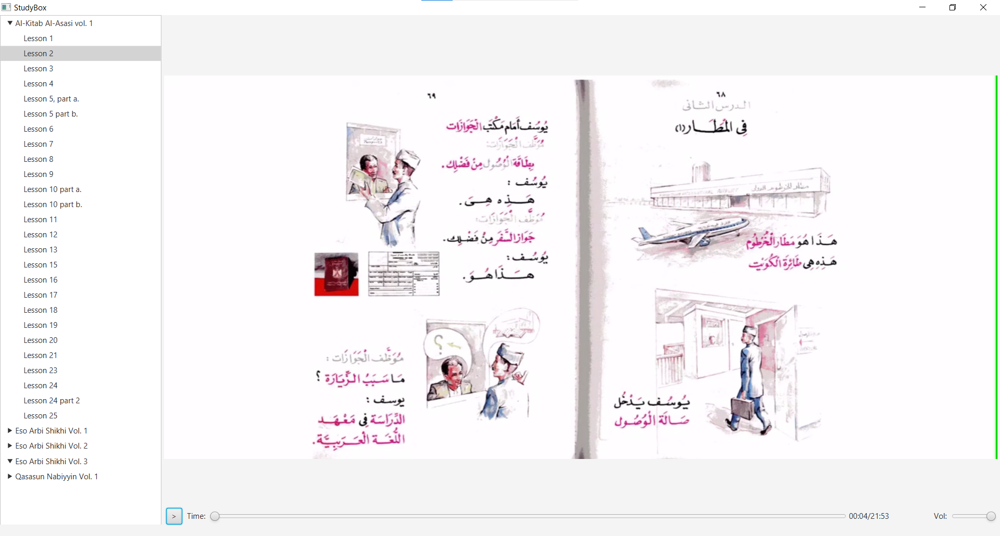

Prepare Playlist
--------
```$bash
pip install pytube
```

```
from pytube import YouTube 
from pytube import Playlist

lists = [
     ('Al-Kitab Al-Asasi vol. 1', 'https://www.youtube.com/playlist?list=PLFXGXcvbZMjJT-OFZ6WjiJEzG8vUSyXGB'),
#     ('Al-Kitab Al-Asasi vol. 2', 'https://www.youtube.com/playlist?list=PLFXGXcvbZMjIlUKfEjZfjqJ38LYdPT66s'),
#    ('Qasasun Nabiyyin Vol. 1', 'https://www.youtube.com/playlist?list=PL5xNtY-o3gWbvTPVSdopOmWA97mw3bfc0')
]

data = []

for item in lists:
    p = Playlist(item[1])

    for url in p.video_urls:
        yt = YouTube(url)

        data.append((item[0], yt.title, url))
    
import pandas as pd

df = pd.DataFrame(data, columns=['Category', 'Title', 'MediaLocation', 'LocalMediaLocation', 'IsViewed' ])
df.to_csv('study-items.csv', index=False, header=True)
```

Sample output
```
Category,Title,MediaLocation,LocalMediaLocation,IsViewed
Al-Kitab Al-Asasi vol. 1,Al Kitab Al Asasi Vol. 1 Lesson 1,https://www.youtube.com/watch?v=kQ0Mjg-Om94,,false
Al-Kitab Al-Asasi vol. 1,Al Kitab Al Asasi Vol. 1 Lesson 2,https://www.youtube.com/watch?v=z18x8QvIJ5s,false
Al-Kitab Al-Asasi vol. 1,Al Kitab Al Asasi Vol. 1 Lesson 3,https://www.youtube.com/watch?v=GTF8aLVPASs,false
Al-Kitab Al-Asasi vol. 1,Al Kitab Al Asasi Vol. 1 Lesson 4,https://www.youtube.com/watch?v=9ZnyA5j9Dqs,false
```

Execute
-------
As of now, run in IDE. Build steps will be added later.

Prepare Binary
---------
```$sh
mvn package shade:shade
```
A shaded jar will be created on the build `target` dir

Run Binary
---------
1. Download JavaFX SDK 19 from https://gluonhq.com/products/javafx/
2. Unzip to suitable location (Say, c:\tools\javafx-sdk-19)
3. Create a script (run-studybox.bat)
```$sh
java -jar --module-path c:\tools\javafx-sdk-19\lib;c:\tools\javafx-sdk-19\bin --add-modules javafx.graphics,javafx.media,javafx.controls,javafx.fxml <PATH_TO_STUDYBOX_BINARY>/study-box-1.0-SNAPSHOT-shaded.jar com.jdreamer.studybox.ui.StudyBox
```
4. Execute the script

Alternately, download the StudyBox binary from GitHub release and modify above script to point to the downloaded jar and execute the script

Screenshot
----------



License
-------

The study-box project is provided under the GPL, version 3 or later.